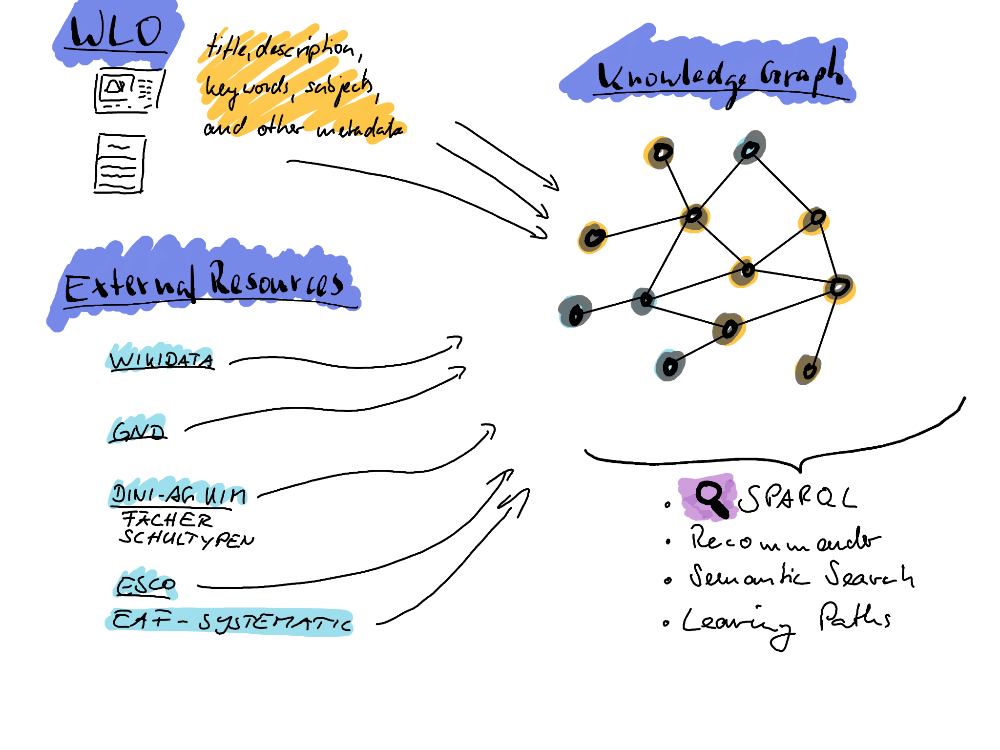
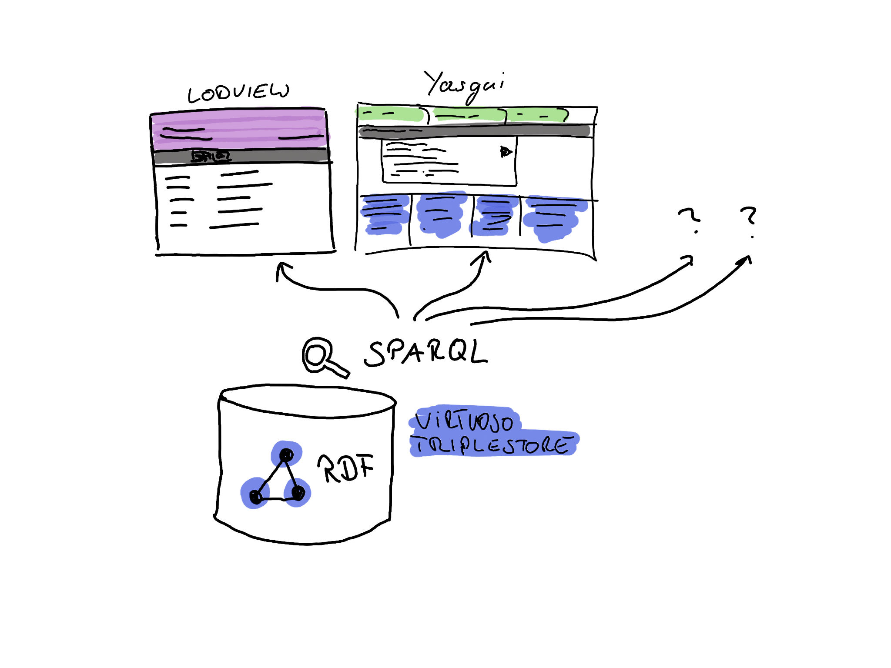

# ITsJOINTLY / WLO Knowledge Graph

Willkommen beim WLO Knowledge Graph (WLOKG).

## Was ist der WLO Knowledge Graph

Der WLO Knowledge Graph ist ein RDF/OWL-basierter Wissensgraph für die Open Educational Resource (OER)-Plattform [Wir Lenen Online (WLO)](https://wirlernenonline.de/). Der Wissengraph wurde im Rahmen des [ITsJOINTLY](https://its.jointly.info/) Projektes entwickelt. Er dient dazu, Bildungsinhalte für Schulen strukturiert, vernetzt und maschineninterpretierbar bereitzustellen. Ziel ist es, die Nutzung und das Wiederauffinden von hochwertigen, offenen Lernmaterialien für Lehrende und Lernende zu erleichtern. Dieser Einführungstext gibt eine Übersicht über den Aufbau und die Funktionsweise des Wissensgraphen sowie über die verwendeten Kernkonzepte des Semantic Web, die ihn ermöglichen.

Die Nutzung eines Wissensgraphen zur Organisation der WLO-Inhalte bietet verschiedene Vorteile: 

- <b>Interoperabilität und Austauschbarkeit:</b> Durch die Verwendung offener Standards wie RDF und OWL ist der Wissensgraph interoperabel und kann leicht mit anderen Systemen und Datenquellen (z.B. Wikidata, DBpedia, Normdaten, etc.) verknüpft werden.

- <b>Skalierbarkeit und Erweiterbarkeit:</b> Neue Themen, Fächer oder Inhalte lassen sich leicht in das vorhandene Wissensnetz einfügen.

- <b>Automatisierung und Empfehlungen:</b> Die Plattform kann auf Basis der Wissensgraphen-Struktur automatisierte Empfehlungen anbieten, die über eine traditionelle Suchfunktion hinausgehen, z.B. thematisch relevante Inhalte.

- <b>Verbesserte Suchbarkeit und Kontextualisierung:</b> Durch die semantische Verknüpfung von Begriffen und Konzepten können Benutzer in angeschlossenen Systemen schneller relevante Informationen finden, die durch ihre Bedeutung und nicht nur durch Schlüsselwörter definiert sind.

- <b>Transparenz und Nachvollziehbarkeit:</b> Der Wissensgraph ermöglicht eine nachvollziehbare Darstellung von Verbindungen, Quellen und Empfehlungen, was die Transparenz und das Vertrauen in die bereitgestellten Inhalte erhöht.

- <b>Multidimensionale Analyse:</b> Der Wissensgraph erlaubt eine vielschichtige Analyse von Inhalten, sodass Trends, Wissenslücken und Zusammenhänge auf verschiedenen Ebenen untersucht werden können.

- <b>Integration von maschinellem Lernen und KI:</b> Der Wissensgraph bildet eine ideale Grundlage für den Einsatz von KI-Algorithmen, die neue Erkenntnisse aus bestehenden Daten ableiten oder verborgene Zusammenhänge entdecken können.

Es gibt zahlreiche Anwendungsszenarien, auf die wir im Verlauf dieses Dokuments eingehen werden.

## Kernkonzepte: RDF, OWL und SPARQL 

Die wichtigsten Technologien, die bei der Erzeugung und Verwendung des WLO Wissensgraphen zum Einsatz kommen sind RDF, OWL und SPARQL. 

### RDF – Die Basisstruktur des Wissensgraphen

RDF (Resource Description Framework) bildet das Fundament des Wissensgraphen. In RDF wird Wissen in Form von sogenannten Tripeln gespeichert, die jeweils aus einem Subjekt, einem Prädikat und einem Objekt bestehen. Ein Beispiel für ein RDF-Tripel in unserem Wissensgraphen könnte sein: „Lernressource A hat Thema ‚Mathematik‘“. Solche Tripel ermöglichen es, Informationen einfach zu verknüpfen und dadurch Wissensnetze zu schaffen. Jeder Teil eines Tripels ist dabei durch einen IRI (International Resource Identifier) eindeutig gekennzeichnet, was Verwechslungen ausschließt und Interoperabilität zwischen verschiedenen Systemen unterstützt. Mehr Details zu RDF können in der <a href="https://www.w3.org/TR/rdf11-concepts/" target="_blank">RDF-Spezifikation</a> gefunden werden.

### OWL – Ontologien zur Definition von Beziehungen

OWL (Web Ontology Language) baut auf RDF auf und erlaubt es, komplexe Beziehungen und Hierarchien zwischen den verschiedenen Bildungsinhalten festzulegen. Eine Ontologie definiert dabei das Vokabular und die Regeln, mit denen die Bildungsressourcen beschrieben und miteinander in Beziehung gesetzt werden können. Beispielsweise könnte in einer OWL-Ontologie definiert sein, dass eine "Lernressource" entweder eine "Aufgabe" oder ein "Lehrplan-Dokument" sein kann und dass jedes Lehrplan-Dokument einem bestimmten Bildungsziel zugeordnet ist. Durch diese semantische Struktur lassen sich Zusammenhänge zwischen verschiedenen Ressourcen und Bildungsstufen logisch abbilden und gezielt für die Suche und Empfehlung nutzen. Die komplette Spezifikation von OWL kann hier gefunden werden: <a href="https://www.w3.org/TR/owl2-overview/" target="_blank">OWL 2 Web Ontology Language </a>

### SPARQL – Abfragen von Informationen###

SPARQL ist die Abfragesprache für RDF-basierte Wissensgraphen. Sie ermöglicht es, spezifische Informationen oder Beziehungen im WLO Wissensgraphen abzurufen, etwa alle verfügbaren Mathematik-Ressourcen für die Sekundarstufe I. Dadurch wird der Wissensgraph durchsuchbar und Nutzer können gezielt Bildungsinhalte finden, die ihren Lernbedürfnissen entsprechen. Die genaue Syntax und eine Beschreibung ihrer Funktionen kann unter <a href="https://www.w3.org/TR/sparql11-query/" target="_blank">SPARQL Abfragesprache</a> gefunden werden.

RDF, OWL und SPARQL sind komplexe Technologien mit vielen Möglichkeiten. Eine übersichtliche Einführung als frei verfügbare Videos gibt die Vorlesung "[Knowledge Graphs - Foundations and Applications](https://open.hpi.de/courses/knowledgegraphs2023/items/78vWmgMAIpElbf4qI5HvMa)". Weitere spannende Resourcen, Links und Tutorials können unter [Awesome Semantic Web](https://github.com/semantalytics/awesome-semantic-web) gefunden werden.

## Wie wird der WLO Knowledge Graph erzeugt

Der WLO Knowledge Graph wird aus Metadaten der Inhalte der [WLO Plattform](https://www.wirlernen.online/) automatisch generiert. Das Update erfolgt in regelmäßigen Abständen (aktuell einmal wöchentlich). Zusätzlich werden auch andere Ressourcen in den Wissensgraphen importiert. Hierzu zählen zum Beispiel relevante Teile aus Wikidata, verschiedene kontrollierte Vokabulare, zum Beispiel aus dem Repository der [DINI AG KIM](https://github.com/dini-ag-kim/), [GND](https://www.dnb.de/DE/Professionell/Standardisierung/GND/gnd_node.html), [Wordnet](https://globalwordnet.org/), Kompetenz Frameworks (z.B. ESCO), Lehrplandaten oder Sachgebietssystematiken. 

Die im WLO Knowledge Graph zusammengestellten Daten können anschließend durch verschiedene Anwendungen abgefragt und verwendet werden. Hierzu zählen unter anderem Empfehlungssysteme, semantische Suche oder Lernpfade.

## Wie ist der Wissengraph aufgebaut?

Zunächst ein kleiner Ausflug in die Welt von RDF.

Gemäß RDF Standard werden alle "Dinge" durch einen <i>International Resource Identifier</i> (IRI) repräsentiert. So steht z.B. der IRI 

	https://dbpedia.org/resource/Albert_Einstein
	
Für den berühmten Wissenschaftler "Albert Einstein". Der IRI ist also ein Symbol für das Konzept, das in unseren Köpfen entsteht, wenn wir z.B. über diese bestimmte Person sprechen. Der IRI repräsentiert also diese Person.

> Warum verwenden wir nicht einfach den Namen? Die natürliche Sprache ist mehrdeutig, d.h. es gibt "Dinge" die denselben Namen haben, aber unterschiedliche Bedeutung (sogenannte Polyseme), z.B. Bank. Erst durch die Verwendung des Begriffes, insbesondere mit welchen anderen Begriffen er verwendet wird (den Kontext), wird klar, welche Bedeutung gemeint ist. Z.B. "die Bank zum Sitzen", "die Bank als Geldinstitut", "die Sandbank". Um auf jeder dieser Bedeutungen klar Bezug nehmen zu können, wird **jede** dieser Bedeutungen durch einen IRI repräsentiert. So bedarf es keinen Kontext mehr, um die Bedeutung zu erkennen.
 

Diese IRIs können dann in Form eines Tripels einen konkreten Fakt ausdrücken. Z.B: 

	<https://dbpedia.org/resource/Albert_Einstein> <http://dbpedia.org/ontology/birthPlace>  <http://dbpedia.org/resource/Ulm> .

In diesem Beispiel aus der [DBpedia](https://www.dbpedia.org/) wird ausgedrückt, dass Albert Einstein in Ulm geboren wurde. 
Die drei Elemente werden üblicherweise als <b>Subjekt Prädikat</b> und <b>Objekt</b> bezeichnet. Eben genau wie ein einfacher Satz. Typischerweise werdend die IRIs in spitze Klammern "<" ">" geschrieben und das Tripel mit einem Punkt "." beendet. Danach kann ein neues Tripel beginnen. 

Die genaue Bedeutung des Prädikats "birthPlace" wird in einer Ontologie beschrieben. In diesem Fall ist es die DBpedia Ontologie. Es ist üblich, dass die IRIs im Browser aufgerufen werden können. Dort ist dann weitere Information verfügbar, wie eben z.B. die ontologische Beschreibung dessen, was der IRI repräsentiert, z.B.: <b>[http://dbpedia.org/ontology/birthPlace](http://dbpedia.org/ontology/birthPlace)</b>

Nicht immer sind die IRIs wie im obigen Beispiel "lesbar". Manchmal enthalten sie nur eine ID und die eigentliche Bedeutung muss dann erst nachgeschlagen werden, z.B.: <b>[http://purl.obolibrary.org/obo/GSSO_000004](http://purl.obolibrary.org/obo/GSSO_000004)</b> .
 

 
Unter anderem aus diesem Grund können auch sogenannte <b>Literale</b> als Objekt verwendet werden. Literale enthalten einfache Daten, die in Form der üblichen Datentypen (z.B. String, Integer, etc.) hinterlegt werden. Das kann z.B. die Beschreibung oder ein Titel dessen sein, wofür der IRI steht.
 
Folgende Tripel zeigen ein Beispiel:

    <http://purl.obolibrary.org/obo/IAO_0000115> <http://www.w3.org/2000/01/rdf-schema#label> "definition" .
	<http://purl.obolibrary.org/obo/GSSO_000004> <http://purl.obolibrary.org/obo/IAO_0000115> "The anniversary of the day on which someone is born." .

IAO\_0000115 hat eine Bezeichnung (label) "definition" und GSSO\_000004 hat ein "IAO_0000115", das lautet "The anniversary of the day on which someone is born." .

Mit anderen Worten: GSSO\_000004 hat die Definition "The anniversary of the day on which someone is born." . 

Das wirkt alles etwas umständlich, aber diese Darstellung ermöglicht es, sehr komplexe Wissenstrukturen logisch auszudrücken, sodass Maschinen bzw. Computerprogramme diese Daten sehr gut verarbeiten können. 

Im Beispiel ist auch zu sehen, dass die Bedeutung der einzelnen IRIs auch wieder durch Tripel beschrieben werden kann. Das erinnert irgendwie an ein "rekursives", sich wiederholendes System. Doch wo beginnt alles?

Die Basis ist eben genau durch den RDF Standard vorgegeben. Dort ist festgelegt, das z.B. der IRI <b>http://www.w3.org/2000/01/rdf-schema#label</b> bedeutet, dass das Literal als Objekt den Titel dessen enthält, was das Subjekt repräsentiert. 
Es gibt natürlich noch zahlreiche weitere vorgegebene Bedeutungen die im [RDF Standard](https://www.w3.org/TR/rdf11-concepts/) nachgelesen werden können.
 
 
Mit RDF können sehr komplexe Zusammenhänge dargestellt werden. Das besondere ist, dass die Art und Weise der Darstellung der Zusammenhänge einer gewissen Logik unterliegen. Deshalb können unter bestimmten Voraussetzungen auch Schlussfolgerungen aus den Daten gezogen werden. Dennoch gibt es Grenzen. RDF hat diesbezüglich nur beschränkte Möglichkeiten. So können z.B. keine Inkonsistenzen festgestellt werden. Hier kommt OWL in Spiel. Mit OWL lassen sich genauere und logisch fundiertere Zusammenhänge beschreiben. Aber dies im Detail zu erklären führt an dieser Stelle zu weit.

 
 
Nun zurück zu WLO:

Mit dem folgenden IRI wird im WLO Knowledge Graphen ein bestimmtes Dokument aus der WLO Plattform repräsentiert:
 
 
<b>[https://edu.yovisto.com/wlo/resource/a44c7b05-2a37-455f-a743-312ff064102e](https://edu.yovisto.com/wlo/resource/a44c7b05-2a37-455f-a743-312ff064102e)</b>
 

 
Klickt man darauf, erhält man die Informationen, die zu diesem Objekt im Knowledge Graphen bekannt sind. 
Oben steht das Subjekt und dann kommen die mit dem Subjekt verbundenen Prädikate (links) und den Objekten (rechts). 
 

 
Zur Darstellung dieser Webseite wird hier eine Software namens [LodView](https://github.com/LodLive/LodView) verwendet. Die eigentlichen RDF Daten befinden sich in einem Triplestore. Dies ist einen spezielle Datenbank, die optimiert ist, RDF Tripel zu verarbeiten. Konkret wird hier der [Virtuoso Triplestore](https://github.com/openlink/virtuoso-opensource) von [OpenLink](https://www.openlinksw.com/) in der OpenSource Variante eingesetzt. LodView ist also eine Anwendung zur Visualiserung der RDF Daten, die an den Triplestore angeschlossen ist.
 

 
Um nur die konreten Tripel zum obigen IRI zu erhalten kann der Paramter "?output=text%2Fplain" an den IRI engehängt werden:
 

 
<b>[https://edu.yovisto.com/wlo/resource/a44c7b05-2a37-455f-a743-312ff064102e?output=text%2Fplain](https://edu.yovisto.com/wlo/resource/a44c7b05-2a37-455f-a743-312ff064102e?output=text%2Fplain)</b> 
 

 
LodView liefert dann die Tripel entsprechend als Textdatei zurück. Diese ist allerdings nicht so gut lesbar, wie die Darstellung in Lodview, dennoch kann diese Textdatei von Programmen, die RDF unterstützen, weiter verarbeitet werden. 
LodView kann die Daten also <b>"menschenlesbar"</b> in Form einer Webseite oder <b>"maschineninterpretierbar"</b> in Form einer Textdatei mit Tripeln ausliefern.
 

  Doch wie kommt LodView eigentlich an die Daten im Tripelstore ran? 

 So ziemlich jeder RDF Tripelstore bietet eine SPARQL Schnittstelle an, mit der die Daten abgerufen werden können. 
SPARQL steht für "SPARQL Protocol And RDF Query Language". Es ist eine formale Abfragesprache mit der Anfragen an den Triplestore gestellt werden können, der dann entsprechend mit Daten antwortet.  

 Ein Beispiel: 

 
	SELECT ?l WHERE {
		<https://edu.yovisto.com/wlo/resource/a44c7b05-2a37-455f-a743-312ff064102e> <https://schema.org/description> ?l .
	}
 

Hierbei steht <b>?l</b> für eine freie Variable, für die im Triplestore konkrete Werte gesucht werden. Die freie Variable kann also anstelle eines IRIs verwendet werden. Die Anfrage lautet also: gibt alle Objekte (?l) der Tripel zurück, deren Subjekt https://edu.yovisto.com/wlo/resource/a44c7b05-2a37-455f-a743-312ff064102e und Prädikat https://schema.org/description ist. 
 

 
Die Anfrage kann im sogenannten SPARQL Endpoint des Triplestores eingegeben werden. Für den hier eingesetzten Virtuoso ist das [https://edu.yovisto.com/sparql](https://edu.yovisto.com/sparql).
 
 
Dort kann diese Anfrage also [eingegeben](https://edu.yovisto.com/sparql?default-graph-uri=&qtxt=SELECT+%3Fl+WHERE+{%0D%0A<https%3A%2F%2Fedu.yovisto.com%2Fwlo%2Fresource%2Fa44c7b05-2a37-455f-a743-312ff064102e>+<https%3A%2F%2Fschema.org%2Fdescription>+%3Fl+.%0D%0A}+&format=text%2Fhtml&should-sponge=&timeout=0&signal_void=on) und abgesendet werden. Mit "Results Format" kann das entsprechende Format der Antwort ausgewählt werden (z.B. HTML für die Darstellung im Browser, oder CSV zum Download als Textdatei.). 
 

 
Zurück zu LodView. Die LodView Web-Applikation erzeugt also aus dem IRI der im Browser aufgerufen wurde eine Anfrage an den SPARQL-Endpoint des Triplestores, erhält die RDF Daten als Antwort zurück und generiert daraus entweder die Webseite oder die Textdatei mit den Tripeln.
 

  
Natürlich können auch andere Apps auf den SPARQL-Endpoint zugreifen. Z.B. sind im folgenden Yasgui-Widget ein paar Beispielanfragen vorbereitet, die an den SPARQL-Endpoint gesendet werden können (Klick auf den dicken Pfeil). [YasGUI](https://docs.triply.cc/yasgui/) ist ein Javascript-basierter SPARQL Editor. 

### Los geht's mit SPARQL

**Zeige die ersten 15 Dokumente und ihren Titel:**

**Zeige 15 Dokumente in deren Titel oder Beschreibungen der Begriff "bismarck" vorkommt:**

## Struktur der Daten

Um zu verstehen, welche Abfragen im Tripelstore möglich sind, ist es essenziell, genau zu wissen, welche Prädikate verwendet werden und welche Objekte sowie Subjekte abgefragt werden können. Mit anderen Worten: Man muss die „Ontologie“ und damit die Struktur der Daten im Tripelstore kennen. Dafür gibt es verschiedene Ansätze. Entweder konsultiert man die vorhandene Dokumentation oder man versucht, die Struktur direkt aus den Daten abzuleiten. Beispielsweise könnte man zunächst alle Prädikate auflisten lassen. Im nächsten Schritt könnte man untersuchen, welche Subjekte ein bestimmtes Prädikat verwenden, und so weiter, bis man genügend Informationen hat, um sinnvolle Abfragen zu formulieren. Idealerweise sind die Daten jedoch umfassend dokumentiert, um diesen Prozess zu erleichtern.

Mit Hilfe von Visualisierung-Tools wie LodView kann die Struktur der Daten relativ leicht erlernt werden. Schauen wir nochmal etwas genauer auf die Struktur der Ressource in LodView: 

[https://edu.yovisto.com/wlo/resource/a44c7b05-2a37-455f-a743-312ff064102e](https://edu.yovisto.com/wlo/resource/a44c7b05-2a37-455f-a743-312ff064102e)

Der Titel der Ressource lautet "Satz des Pythagoras". Lodview zeigt den Titel gut lesbar oben an. Die eigentliche Information steckt im Tripel: 

	<https://edu.yovisto.com/wlo/resource/a44c7b05-2a37-455f-a743-312ff064102e> <https://schema.org/name> "Satz des Pythagoras" . 

Dieses Tripel wird in LodView etwas weiter unten angezeigt. Um den Titel anzugeben wird also das Prädikat "https://schema.org/name" verwendet. 

Auf ähnliche Weise werden auch die folgenden Informationen anhand der Prädikate angezeigt:

- https://schema.org/**description** : Beschreibung der Ressource
- https://schema.org/**keywords** : freie Schlüsselwörter
- https://schema.org/**identifier** : der WLO Identifikator (edusharing Plattform)
- https://schema.org/**license** : die Lizenz der Ressource
- https://schema.org/**url** : der URL der Quelle er Ressource
- http://edu.yovisto.com/ontology/1.0/**dateCreated** : Zeitpunkt an dem die Ressource in WLO angelegt wurde
- http://edu.yovisto.com/ontology/1.0/**dateModified** : Zeitpunkt er letzen Änderung bei WLO
- http://www.w3.org/1999/02/22-rdf-syntax-ns#**type** : Typ der Ressource 
- http://www.w3.org/2000/01/rdf-schema#**isDefinedBy** : Named Graph, in dem die Ressource im Triplestore gespeichert ist
- http://xmlns.com/foaf/0.1/**depiction** : verweist auf ein Bild (dies wird von Lodview oben angezeigt) 
- https://schema.org/**audience** : verweist auf eine Liste von Nutzer Rollen, für die die Ressource geeignet ist (z.B. für Schüler und/oder Lehrer)
- https://schema.org/**about** : zeigt auf eine Liste von Schulfächern
- http://w3id.org/openeduhub/terms/**educationalContext** : zeigt auf eine Liste von Schulstufen
- http://w3id.org/openeduhub/terms/**widget** : zeigt auf eine Liste von möglichen Darstellungstemplates der WLO Plattform 
- https://w3id.org/curriculum/**hasAnnotationTarget** : verweist auf semantische Textannotationen (dazu später mehr)

In LodView werden einige Prädikate zur besseren Übersichtlichkeit mithilfe von Präfixen abgekürzt. Ein Beispiel hierfür ist die Abkürzung des Prädikats `http://www.w3.org/1999/02/22-rdf-syntax-ns#type`, das in der Präfixschreibweise als `rdf:type` dargestellt wird. Diese Schreibweise macht die Darstellung von Prädikaten kompakter und leichter lesbar, insbesondere bei langen URIs.

Das Kürzel eines Präfixes, wie beispielsweise `rdf:` in diesem Fall, kann prinzipiell frei gewählt werden, solange es innerhalb des jeweiligen Kontextes eindeutig bleibt. Dennoch gibt es für einige Präfixe etablierte Konventionen, die in der Praxis weitgehend einheitlich verwendet werden. Beispiele für solche standardisierten Präfixe sind `rdf` (für das RDF-Vokabular), `rdfs` (für das RDF Schema), `owl` (für die Web Ontology Language) und `foaf` (für das „Friend of a Friend“-Vokabular). Diese Konventionen erleichtern die Arbeit, da sie für Entwickler und Nutzer direkt nachvollziehbar sind und einen einheitlichen Standard gewährleisten.

Die Präfixschreibweise trägt somit nicht nur zur Übersichtlichkeit bei, sondern erleichtert auch die Zusammenarbeit und das Verständnis in Projekten, die auf RDF-Daten und Ontologien basieren.

Da wir nun die Struktur eines Dokuments kennen, können wir ein paar weitere komplexere Abfragen machen:

**Zeige 10 Dokumente des Fach Mathematik:**

Es ist natürlich hilfreich, wenn vorab bekannt ist, dass der IRI `http://w3id.org/openeduhub/vocabs/discipline/380` das Schulfach Mathematik repräsentiert. Um alle Schulfächer herauszufinden, könnte z.B. folgende Anfrage ausgeführt werden. 

**Zeige alle Schulfächer, die verwendet werden:**

**Wie viele Dokumente gibt es im Fach Mathematik:**

## Zusammenfassung

Der WLO Knowledge Graph enthält die öffentlichen Metadaten der Bildungsinhalte der Wirlernenonline Plattform. Diese sind in RDF gespeichert und über einen SPARQL Endpoint abrufbar. 

In diesem Abschnitt wurde RDF und die Struktur der Daten auf einem recht groben Niveau eingeführt. Für detaillierte Informationen wird auf die entprechenden Standards und Dokumentationen verwiesen. 

In nächsten Abschnitt werden Verfahren zur semantischen Analyse der Bildungsinhalte erläutert. Sie sind die Grundlage für intelligente Vernetzung der Inhalte untereinander und mit anderen externen Inhalten.

